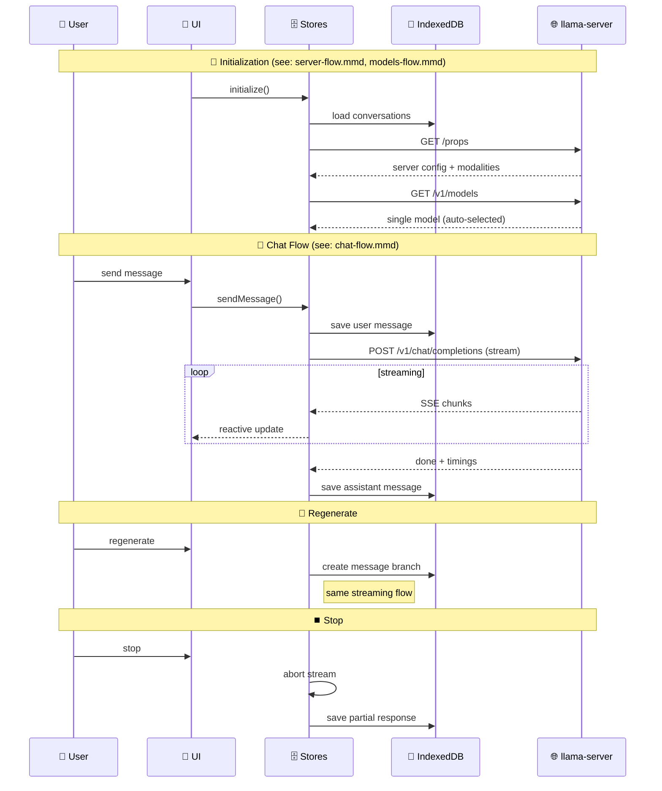

# data-flow-simplified-model-mode.md

- Source: `llama.cpp/tools/server/webui/docs/flows/data-flow-simplified-model-mode.md`
- Extract: `text`
- SHA256: `1a5ea2790bde14917b56deba530ce42533d9635e0a31c184801a9a8105be06aa`

## Content

<!-- ARGOS_MEMORY_WEB:START -->
## Связи памяти

- Центральный узел: [[ARGOS Memory Web]]
- Тематический узел: [[Training Hub]]
- Карта памяти: [[Карта памяти]]
- Контекст работы: [[Контекст работы]]
- Журнал MCP: [[2026-05-04 MCP Skill Audit]]
- Источник связи: `local-vault`
<!-- ARGOS_MEMORY_WEB:END -->

[[Backbone Hub]]

## Graph Bridge
- [[ARGOS Memory Web]]
- [[Backbone Hub]]
- [[Training Hub]]
